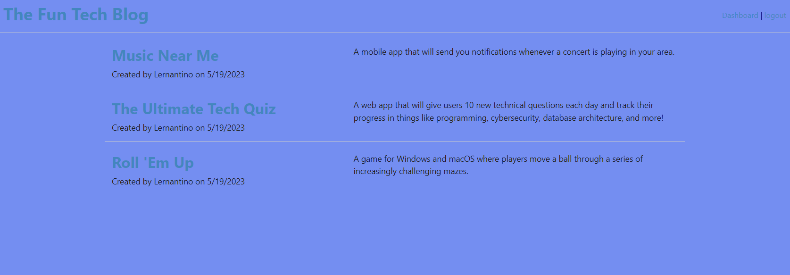

# MVC-Tech-Blog

## Description

This website is for making blog post, being able to comment on other peoples blog post and having a login for all your own personal post.

## Table of Contents

- [Installation](#installation)
- [Usage](#usage)
- [License](#license)
- [Features](#features)

## Installation

Bcrypt, Dotenv, Express, Express-handlebars, Express-session, Mysql2, and Sequelize were all used and installed to make this running.

## Usage

 
[Click here to see Deployed Application](https://still-shore-70244.herokuapp.com/)

## License

N/A

## Features

-Making A Post 
-Commenting On A Post 
-Login/SignUp